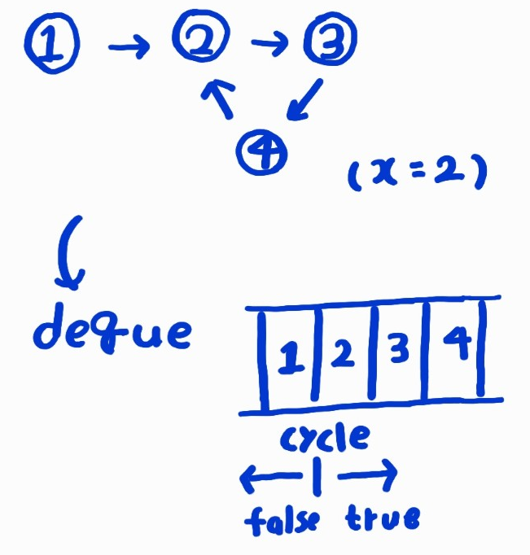

# 백준 알고리즘 16947번: 서울 지하철 2호선(Java)

<a>https://www.acmicpc.net/problem/16947</a>

## 로직

사이클을 찾아내고, 각 점으로부터 사이클까지의 거리를 계산해야 하는 문제이다.

먼저 각각의 간선으로 주어지는 입력을, 인접리스트로써 ArrayList의 배열인 a로 받는다.

getCycle()은 사이클에 포함되는 점과 아닌 점을 구별하는 isCycle 배열을 완성시키는 메서드이다.  
깊이우선 탐색과정에서 deque을 이용하여 탐색한 경로를 저장한다.

탐색 중 기존에 탐색했던 점에 돌아왔다면, 이는 사이클을 발견했음을 의미한다.  
덱의 원소들을 확인하면서 isCycle 배열에 값을 입력한다.

각 원소를 확인하는 방법은 아래와 같다.  
x가 기준점으로, 앞의 원소는 사이클에 포함되지 않고, x를 포함한 뒤의 원소는 사이클에 포함된다.

## 개선점

재귀함수를 구현하는데 표현력의 한계가 있음을 느꼈다.  
재귀함수를 잘 활용한다면, 각각의 재귀 호출에서 사이클에 포함되는 점인지에 대한 처리도 함께 할 수 있을 것이다.
